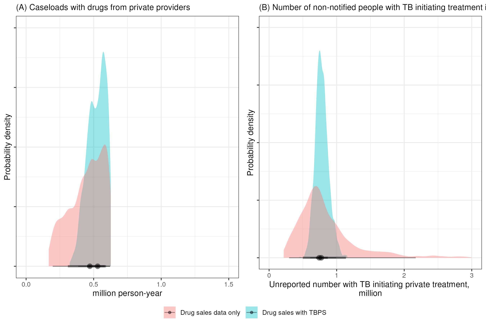
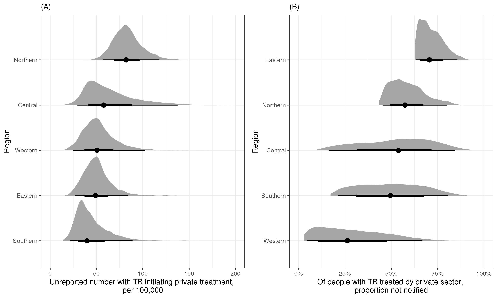
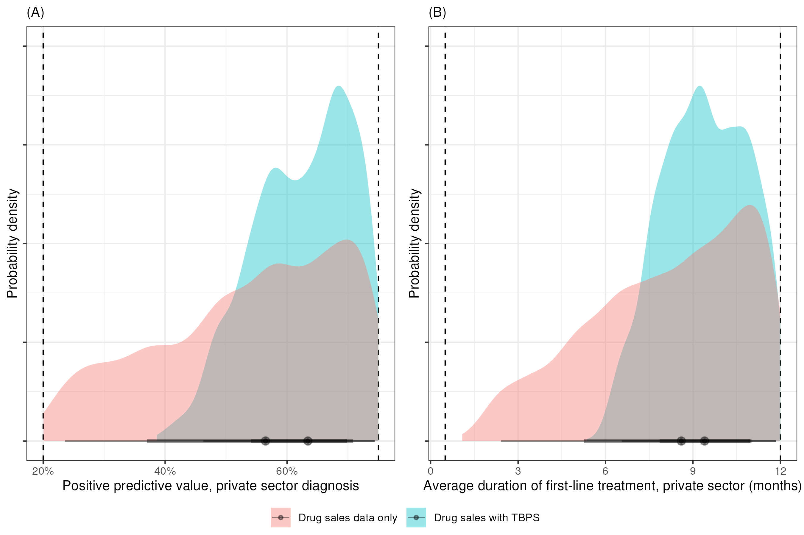
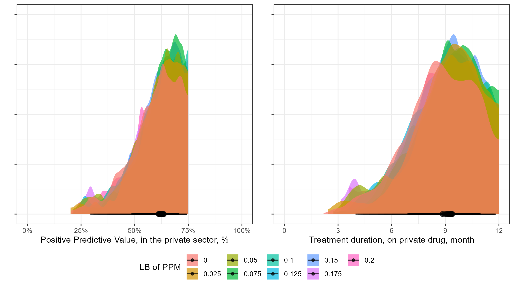
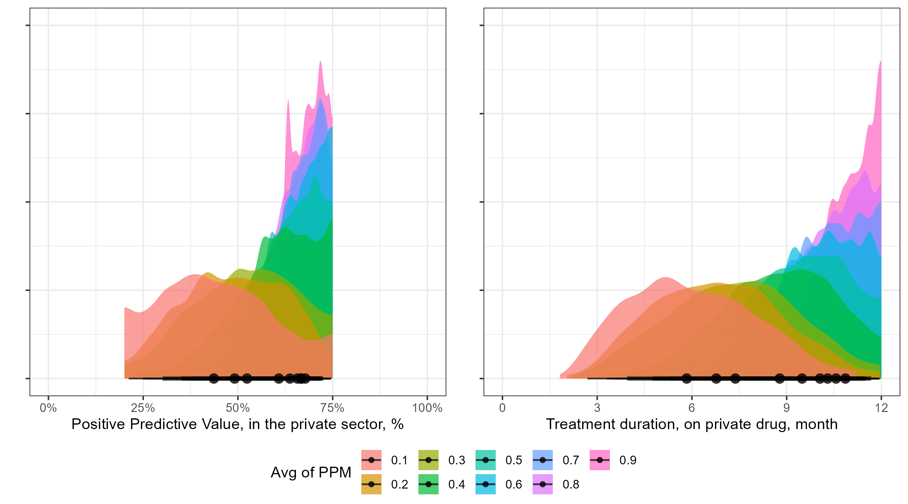
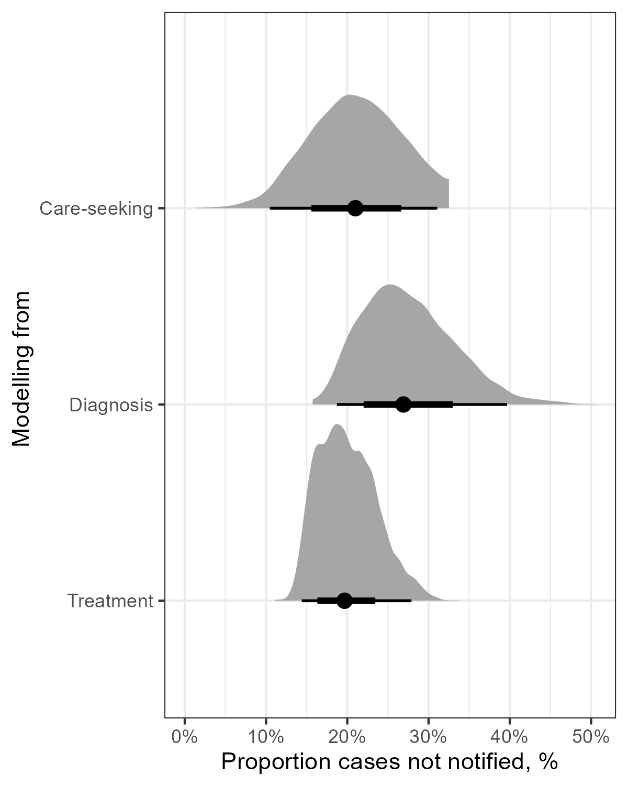

# IndTB_underreport
Investigate the burden of India TB case under-reporting in the private  sector

### Settings

- **Locations**: India and state-level data
- **Data**: 
  - National TB prevalence survey, India, 2019-2021
  - Nikshay data: case-notification by public/private sectors
  - Drug sale data for matching anti-TB treatments
- **Language**: R with stan

## Posterior distribution of main results

### National level

### State level

### Region level

## Posterior distribution of key parameters 

## Sensitivity analysis

### The lower bound of PPM level

### The shape of PPM level

### Entry point of modelling

